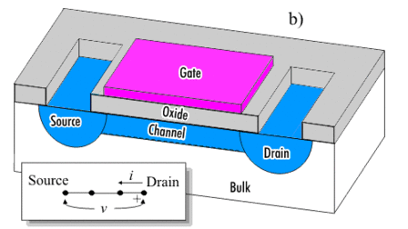
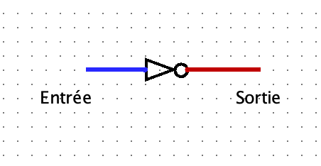
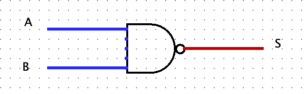
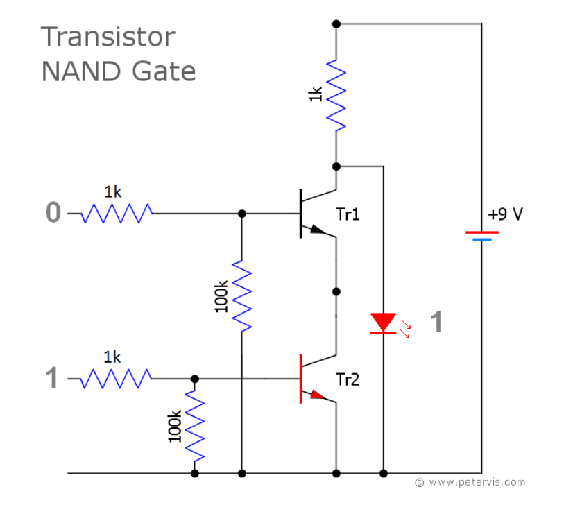
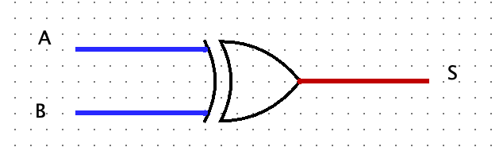
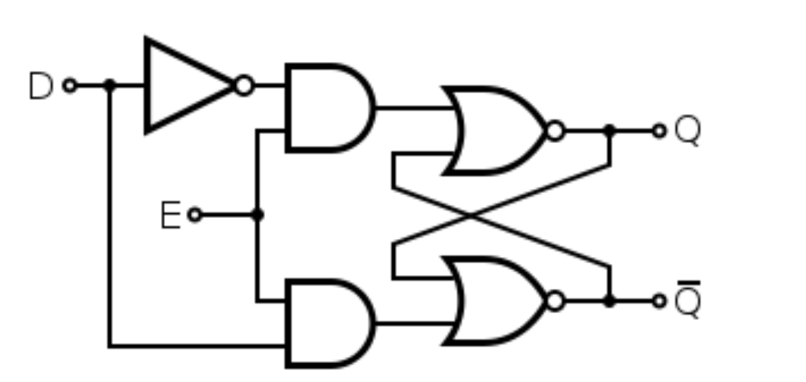
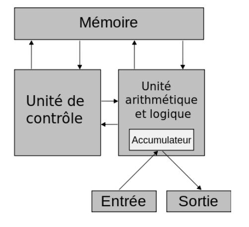
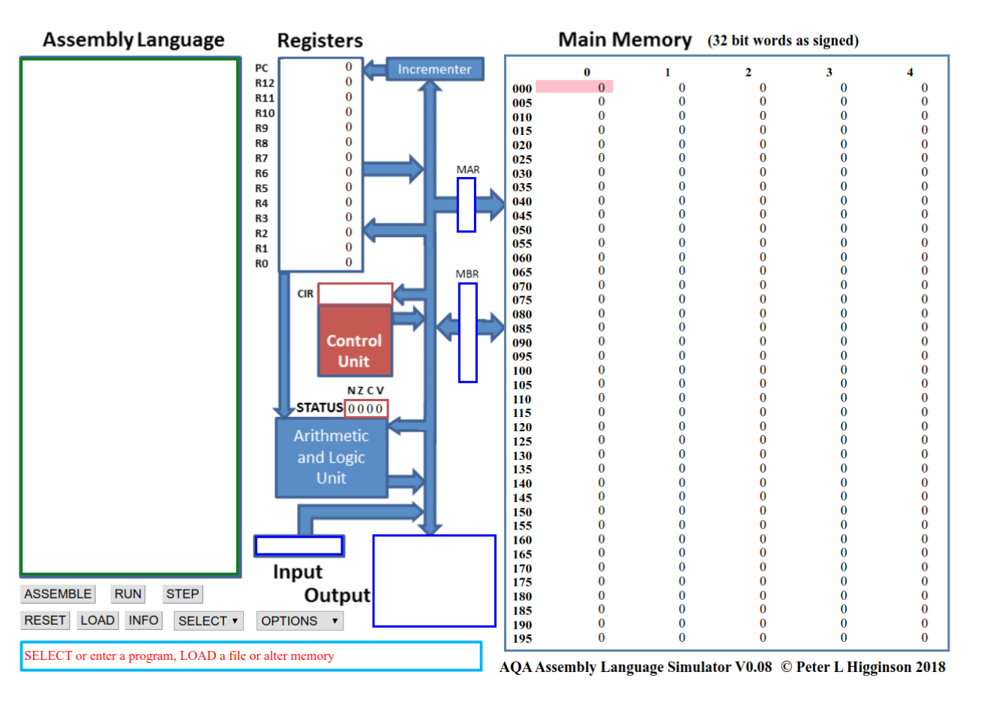

<h1> Architecture matérielle</h1>

## Les portes logiques 
### Contexte

Les circuits d’un ordinateur manipulent uniquement des chiffres binaires 0 ou 1 qui sont simplement représentés par des tensions électriques (0 ou +V). On peut réaliser des opérations sur ces nombres binaires à l’aide de circuits logiques qui sont concrètement construits à partir de transistors. Ces transistors peuvent se comporter comme des interrupteurs à la manière de l’exemple suivant.

<figure markdown>
  {width=200px}
  <figcaption>transistor</figcaption>
</figure>

<figure markdown>
  {width=500px}
  <figcaption>transistor</figcaption>
</figure>

Lorsque la broche B est sous tension (+V), un courant peut s’établir entre E et la masse . Le sens du courant est indiqué par la petite flèche. Le transistor peut alors être considéré comme un interrupteur fermé. Inversement, quand B est à 0 V, la broche E reste sous tension haute et le transistor peut être considéré comme un interrupteur ouvert.

### La porte NOT (ou NON)
La porte NOT demande un seul transistor. Elle est la plus simple de toutes les portes.

<figure markdown>
  {width=300px}
  <figcaption>transistor</figcaption>
</figure>

 Elle n’a qu’un seul bit en entrée (E) et sa sortie (S) vaut 1 quand l’entrée vaut 0 et inversement. on peut obtenir ce que l’on appelle la table de vérité de la porte "NOT" (voir ci-dessous).

<figure markdown>
|entrée E | sortie S|
|:----:|:----------:|
|Ø     | 1          |
|1     | Ø          |
<figcaption>Table de vérité de la porte NOT</figcaption>
</figure>

On en déduit l'équation suivante : $S = \overline{E}$

Graphiquement, on représente cette porte comme dans le schéma ci-dessous (notation américaine). 

<figure markdown>
  {width=300px}
  <figcaption>Porte NOT</figcaption>
</figure>


### La porte AND (ET)

La table de vérité de la porte "AND" est représentée ci-dessous.

<figure markdown>
|entrée A |entrée B | sortie S|
|:-------:|:-------:|:-------:|
|Ø        | 0       |0        |
|0        | 1       |0        |
|1        |0        |0        |
|1        |1        |1        |

<figcaption>Table de vérité de la porte AND</figcaption>
</figure>

On peut en déduire l'équation $S =A.B$

<figure markdown>
  {width=300px}
  <figcaption>Porte AND</figcaption>
</figure>

On peut illustrer cette fonction de la manière suivante: Une lampe s'allume si l'on appuie sur « a » ET « b » et seulement dans ce cas là. La fonction « ET » est caractérisée par des interrupteurs NO (normalement ouvert) montés en série.

<figure markdown>
  .png){width=200px}
  <figcaption>Illustration</figcaption>
</figure>


### La porte NAND (NON ET)
La table de vérité de la porte "NAND" est représentée ci-dessous.

<figure markdown>
|entrée A |entrée B | sortie S|
|:-------:|:-------:|:-------:|
|Ø        | 0       |1        |
|0        | 1       |1        |
|1        |0        |1        |
|1        |1        |0        |

<figcaption>Table de vérité de la porte NAND</figcaption>
</figure>

On peut en déduire l'équation $S = \overline{A.B}$

<figure markdown>
  {width=200px}
  <figcaption>Porte NAND</figcaption>
</figure>

**Remarque :** 

Cette porte peut être réalisée de la manière suivante: 
<figure markdown>
  {width=400px}
  <figcaption>Circuit porte NAND</figcaption>
</figure>

### Porte OR (OU)
La table de vérité de la porte "OR" est représentée ci-dessous.

<figure markdown>
|entrée A |entrée B | sortie S|
|:-------:|:-------:|:-------:|
|Ø        | 0       |0       |
|0        | 1       |1        |
|1        |0        |1        |
|1        |1        |1       |

<figcaption>Table de vérité de la porte OR</figcaption>
</figure>

On peut en déduire l'équation $S = A + B $

<figure markdown>
  {width=300px}
  <figcaption>Porte OR</figcaption>
</figure>

### Porte NOR (NON OU)
La table de vérité de la porte "NOR" est représentée ci-dessous.

<figure markdown>
|entrée A |entrée B | sortie S|
|:-------:|:-------:|:-------:|
|Ø        | 0       |1       |
|0        | 1       |0        |
|1        |0        |0        |
|1        |1        |0       |

<figcaption>Table de vérité de la porte NOR</figcaption>
</figure>

On peut en déduire l'équation $ S = \overline{A + B} $

<figure markdown>
  {width=300px}
  <figcaption>Porte OR</figcaption>
</figure>

**Remarque :** 

Cette porte peut être réalisée de la manière suivante: 
<figure markdown>
  {width=400px}
  <figcaption>Circuit porte NOR</figcaption>
</figure>

### La porte XOR (OU EXCLUSIF)
La table de vérité de la porte "XOR" est représentée ci-dessous.

<figure markdown>
|entrée A |entrée B | sortie S|
|:-------:|:-------:|:-------:|
|Ø        | 0       |0       |
|0        | 1       |1        |
|1        |0        |1        |
|1        |1        |0        |

<figcaption>Table de vérité de la porte XOR</figcaption>
</figure>

<figure markdown>
  {width=300px}
  <figcaption>Porte XOR</figcaption>
</figure>

### Une application des portes logiques : les masques de sous-réseau
Dans un réseau TCP/IP, un ordinateur a une adresse IP qui l’identifie de manière unique (comme un numéro de téléphone), ainsi qu’un masque de sous-réseau.

L’adresse IP et le masque de sous-réseau sont des groupes de 4 entiers positifs, codés tous les deux sur 4 octets. Le masque identifie à quel sous réseau d’Internet il fait partie, et permet d’obtenir l’adresse IP du sous-réseau à l’aide d’une opération booléenne.

**Exemple :** un ordinateur a pour adresse IP 192.168.0.42 et son masque de sous-réseau est 255.255.255.0.
<figure markdown>
|IP    |11000000101010000000000000101010   |
|:----:|:---------------------------------:|
|Masque|11111111111111111111111100000000   |
|AND   |11000000101010000000000000000000   |
|Adresse du sous-réseau |                |

<figcaption>Porte XOR</figcaption>
</figure>

Pour obtenir l’adresse du sous-réseau de l’ordinateur, on effectue alors un AND entre les octets de l’adresse IP et les octets du masque. En représentation binaire, cela donne :

Sur un processeur 32 bits, le AND est une opération primitive du processeur, donc l’opération de déter- mination du sous-masque réseau se fait en une opération.

!!! example "Exercice :"  
    Cherchez l’adresse IP de votre ordinateur et le masque de sous-réseau. Sous Windows, il faut taper `ipconfig` et sous Linux , la commande est `ifconfig`. Écrire l’adresse du sous-réseau trouvé.

## Des portes logiques à l’ordinateur
### Circuit combinatoire et circuit séquentiel
D’une manière générale, les circuits électroniques possèdent plusieurs entrées et plusieurs sorties. Quand les sorties dépendent directement et uniquement des entrées, on parle de cicuits combinatoires. Il existe d’autres types de circuit qui s’appellent circuits séquentiels. Les sorties de ces circuits dépendent d’un état antérieur du circuit. C’est ce type de cicuit qu’on utilise pour réaliser des mémoires (RAM, registres,etc...).

### Un exemple de circuit combinatoire logique : l’additionneur
En combinant les portes logiques, on obtient des circuits plus complexes. Par exemple en combinant 2 portes "OU EXCLUSIF", 2 portes "ET" et une porte "OU" on obtient un additionneur représenté ci-dessous.

<figure markdown>
  {width=400px}
  <figcaption>Additionneur</figcaption>
</figure>

Comme son nom l’indique, l’additionneur permet d’additionner 2 bits (E1 et E2) en tenant compte de la retenue entrante ("Cin" "carry in" en anglais). En sortie on obtient le résultat de l’addition (S) et la retenue sortante ("Cout").

!!! example "Exercice :"  
    Recopier puis compléter la table de vérité de l’additionneur ci-dessus.

    |E1 |E2 | Cin | Cout|S   |
    |:-:|:-:|:---:|:---:|:--:|
    |Ø  | 0 | Ø   | 0   |0   |
    |0  |  Ø|  1  | 0   |    |
    |0  | 1 | 0   |     |    |
    |0  | 1 |  1  |     |    |
    |1  | 0 | 0   |     |    |
    |1  | 0 | 1   |     |    |
    |1  | 1 | 0   |     |    |
    |1  | 1 | 1   |     |    |

### Les mémoires
On stocke l’information à l’aide de circuit dit de type "bascule". Ce circuit est une combinaison de plusieurs portes logiques.

Il n’est pas question pour nous d’étudier ce type de circuit, le schéma ci-dessus vous permet juste de vérifier qu’une fois de plus nous avons bien à faire à une combinaison de porte logique.

<figure markdown>
  {width=400px}
  <figcaption>Mémoire</figcaption>
</figure>

## Le modèle de von Neumann

### Le principe


John Von Neumann (1903-1957) est un ingénieur, mathématicien et physicien américano-hongrois.Il a participé au projet Manhattan (première bombe atomique) et à l'ENIAC. Son nom reste attaché à un modèle qu'il propose en 1944, modèle d'architecture novateur qui sert toujours de base à nos architectures actuelles.

Le modèle de von Neumann précise les 4 composants essentiels ainsi que les interactions entre ces différents composants. Ces composants sont les suivants :

* l'unité de commande :
    *  Lire le programme
    *  décoder les instructions
    *  commander leur exécution ;
* l'unité arithmétique et logique(UAL ou ALU en anglais) : son rôle est d’effectuer les
opérations de base  ;
* la mémoire : qui contient à la fois les données à traiter et les instructions du programme. Cette idée de stocker au même endroit données et programme est l'idée centrale de l'architecture von Neumann ;
* les dispositifs d’entrée-sortie, qui permettent de communiquer avec le monde extérieur..

Les différents éléments échangent des informations à l’aide de bus.

<figure markdown>
  {width=400px}
  <figcaption>Modèle de Von Neumann</figcaption>
</figure>

* L'horloge est le cadenceur qui organise l'accomplissement des instructions, et dont l'unité est appelé cycle d'horloge (1 cycle = 1 instuction).

Les deux premières parties sont habituellement rassemblées dans un ensemble de circuits électroniques qu’on appelle Unité Centrale de Traitement ou plus simplement processeur (ou CPU pour Centrale Processing Unit).

Physiquement,un système informatique est constitué de plusieurs éléments : Une machine, c’est-à-dire un boîtier contenant une carte mère avec un microprocesseur, des barrettes de mémoire vive, une carte graphique une carte réseau, des ports de communication et des périphériques


### Principaux composants du modèle de Neumann

#### Unité de contrôle
Cette unité joue le rôle de chef d’orchestre de l’ordinateur. C’est ce composant qui est chargé récupérer en mémoire la prochaine instruction à exécuter et les données sur lesquelles elle doit opérer puis les envoie à l’UAL.


#### Mémoires
La mémoire de l’ordinateur contient à la fois les programmes et les données. On distingue habituellement deux types de données :

* la mémoire vive ou volatile est celle qui perd son contenu dès que l’ordinateur est éteint. Les données stockées dans la mémoire vive peuvent être lues, effacées ou déplacées comme on le souhaite. Le principal avantage de cette mémoire est la rapidité d’accès aux données. On parle souvent de mémoire RAM (pour l’anglais Random Acces Memory ). Les ordinateurs actuels disposent en général de 8 ou 16 Go de RAM.
  
* la mémoire non-volatile est celle qui conserve ses données quand on coupe l’alimentation électrique de l’ordinateur. Il existe plusieurs types de telles mémoires. Par exemple, la ROM (pour Read-only Memory) est une mémoire non modifiable qui contient habituellement des données nécessaires au démarrage de l’ordinateur ou tout autre information dont l’ordinateur a besoin pour fonctionner. La mémoire Flash est autre exemple de mémoire non volatile. Contrairement à la ROM, cette mémoire est modifiable. Contrairement à la RAM, ces mémoires sont souvent beaucoup plus lentes.


## Assembleur

### Le simulateur
On trouve en ligne un [simulateur](http://www.peterhigginson.co.uk/AQA/). 

**Remarque :** ne pas l’ouvrir avec Firefox car dans ce navigateur, les instructions ne s’affichent pas correctement dans la RAM.

<figure markdown>
  {width=800px}
  <figcaption>simulateur</figcaption>
</figure>


Il se décompose ainsi :

* Une mémoire vive (à droite) dont chaque case mémoire (cellule) comporte 32 bits . Chaque cellule de
la mémoire possède une adresse (de 000 à 199), ces adresses sont codées en base 10 (vous pouvez vous en assurer en cliquant sur OPTION puis binary).
* Un éditeur (à gauche) pour taper le programme en assembleur ;
* Le processeur (au centre) constitué principalement de l’Unité de Contrôle, de l’Unité Arithmétique et Logique et des registres de R0 à R12 plus un compteur de programme (PC pour Program counter) qui contient en permanence l’adresse de la prochaine instruction à exécuter.

### Les instructions
Chaque processeur possède son propre jeu d'instruction. Pour celui proposé, les instructions sont disponibles sur cette [page](https://www.peterhigginson.co.uk/AQA/info.html). Voici les principales instructions traduites :

* **LDR Rd, &LT; adresse mémoire &GT;** :  charge la valeur enregistrée dans l' &LT; adresse mémoire &GT;** dans le registe d
*  **STR Rd, &LT; adresse mémoire &GT;** : enregistre la valeur du registre d dans la mémoire spécifiée par &LT; adresse mémoire &GT;
* **ADD Rd, Rn, &LT; operand2 &GT;** :  ajoute la valeur spécifiée par &LT; operand2 &GT; à la valeur du registre n et enregistre le résultat dans le registre d
* **SUB Rd, Rn, &LT; operand2 &GT;** : soustrait la valeur de &LT; operand2 &GT; à la valeur du registre n et enregistre le résultat dans le registre d
* **MOV Rd, &LT; operand2 &GT;** :  copie la valeur &LT; operand2 &GT; dans le registre d
* **CMP Rn, &LT; operand2 &GT;**  : compare la valeur de registre n avec la valeur de &LT; operand2 &GT;.
 
* **B  &LT; label &GT;** : branchement inconditionnel jusqu'à la positon &LT; label &GT; dans le programme.
 
* **B &LT; condition &GT; &LT; label &GT;** : branchement conditionnel vers la position &LT; label &GT; dans le programme si la dernière comparaison rempli le critère spécifié par &LT; condition &GT;. Les valeurs possibles sont : EQ:égal à ; NE: n'est pas égal à; GT:Plus grand que; LT: Moins grand que.
* **AND Rd, Rn, &LT; operand2 &GT;** :  effectue l'opération bit à bit logique AND (ET) entre la valeur du registre n et la valeur &LT; operand2 &GT; et enregistre le résultat dans le registre d.
* **ORR Rd, Rn, &LT; operand2 &GT;** effectue l'opération bit à bit logique OR (OU) entre la valeur du registre n et la valeur &LT; operand2 &GT; et enregistre le résultat dans le registre d.
* **EOR Rd, Rn, &LT; operand2 &GT;** : effectue l'opération bit à bit logique XOR(OU exclusif) entre la valeur du registre n et la valeur &LT; operand2 &GT; et enregistre le résultat dans le registre d.
* **MVN Rd, &LT; operand2 &GT;** : effectue l'opération bit à bit logique NOT (NON) sur la valeur &LT; operand2 &GT; et enregistre le résultat dans le registre d.
* **LSL Rd, Rn, &LT; operand2 &GT;** : décale de &LT; operand2 &GT; bit(s) vers la gauche la valeur du registre n et enregistre le résultat dans le registre d
* **LSR Rd, Rn, &LT; operand2 &GT;** :  décale de &LT; operand2 &GT; bit(s) vers la droite la valeur du registre n et enregistre le résultat dans le registre d
* **HALT** Arrête l'execution du programme.
  
* **&LT; operand2 &GT;** peut être #nnn (c'est à dire un nombre, exemple #42) ou bien Rm (c'est à dire le registre m , par exemple R1 est le registre numéro 1)
 
* Les registres vont de R0 à R12.

**Compléments data, INP et OUT :**

* la pseudo instruction DAT vous permet de mettre un nombre dans la mémoire en utilisant l'assembleur. Un label peut aussi être pris comme donnée.

* INP Rd,2 : lis un nombre dans le registre d.

* OUT Rd,4  : retourne en sortie le nombre du registre d. Pour OUT, vous pouvez retourner des nombres signés (positifs ou négatifs $\rightarrow$ paramètre 4), des nombres non signés (que positifs $\rightarrow$ paramètre 5), des hexadécimaux (paramètre 6) ou des charactères (paramètre 7). Vous pouvez entrer des hexa comme 0xnnn partout où un nombre est attendu.

### Exemples et exercices

#### Exemple 1
```
MOV R0,#42
STR R0,150
HALT
```

**Interprétation :**

* On place dans le registre R0 du processeur la valeur 42 ;
* On place le contenu du registre R0 (à savoir 42) dans la mémoire vive à la place 150 ;
* On stoppe le programme ;
* Taper ce programme dans l’éditeur du simulateur, et le faire fonctionner. Observer.


#### Exercices

!!! example "Exercice :"
    À l’aide des instructions décrites dans le chapitre précédent, dites ce que fait ce programme suivant ligne par ligne, puis l’exécuter. Vérifier ce que vous aviez trouvé.

```assembly
MOV R0,#42
MOV R1,#45
ADD R0,R0,R1
OUT R0,4
HALT
```

!!! example "Exercice :"
    Écrire un programme qui effectue une soustraction entre 95 et 52, l’enregistre en mémoire (à la place 143) et qui affiche le résultat dans la console Output. Le taper et l’exécuter.

#### Exemple 2
Cet exemple s’affiche quand on clique sur `SELECT` puis `max` dans le simulateur.

```assembly
        INP R0,2
        INP R1,2
        CMP R1,R0
        BGT HIGHER
        OUT R0,4
        B DONE
HIGHER:
        OUT R1,4
DONE:
        HALT
```

**Interprétation :**

* On place deux nombres dans les registres R0 et R1 grâce à la fonction INP ;
* On compare le contenu du registre R1 au contenu du registre R0 ;
* Si le contenu de R1 est plus grand que celui de R0, on effectue un branchement jusqu’au label HIGHER
et on affiche le contenu de R1 ;
* Sinon, on affiche le contenu de R0 ;
* On effectue le branchement conditionnel vers done qui stoppe le programme.

!!! example "Exercice :"
    Réaliser un programme qui prend deux nombres et qui retourne le plus petit.

!!! example "Exercice :"
    Traduire le programme python ci-dessous en assembleur

```python
x=0   // on met  en memoire dans la variable nomme x la valeur 0
while x < 3:
    x = x + 1
    print(x)
```

#### L’assembleur et le python
En python aussi, on peut avoir une idée de ce qui est traduit en langage machine grâce à la bibliothèque dis comme dans l’exemple suivant. Taper l’exemple suivant dans un éditeur Python et observer.

```python
import dis
dis.dis(’x=1; x=x+1’)
```

!!! example "Exercice :"
    Traduire en assembleur AQA (celui que nous avons vu) le langage d’assemblage issu du python.


## Bibliographie

* [Le site de David Roche](https://pixees.fr/informatiquelycee/n_site/index.html)
* [Le site des enseignants du lycée Blaise Pascal à Saint-Dizier](http://monlyceenumerique.fr/nsi_
     premiere/index.html)
* [Le simulateur ainsi que la documentation en anglais](http://www.peterhigginson.co.uk/AQA/)
*  [Le site du Yeti](http://lesmathsduyeti.fr/lycee/nsi-1iere/language-assembleur/)
* Le livre Numérique et Sciences Informatiques aux éditions ellipses de Thibaut Balabonski, Sylvain
Conchon, Jean-Christophe Filliâtre et Kim Nguyen.


=== "`C`"

    ```c
    #include <stdio.h>

    int main(void) {
      printf("Hello world!\n");
      return 0;
    }
    ```

=== "`C++`"

    ```cpp
    #include <iostream>

    int main(void) {
      std::cout << "Hello world!" << std::endl;
      return 0;
    }
    ```